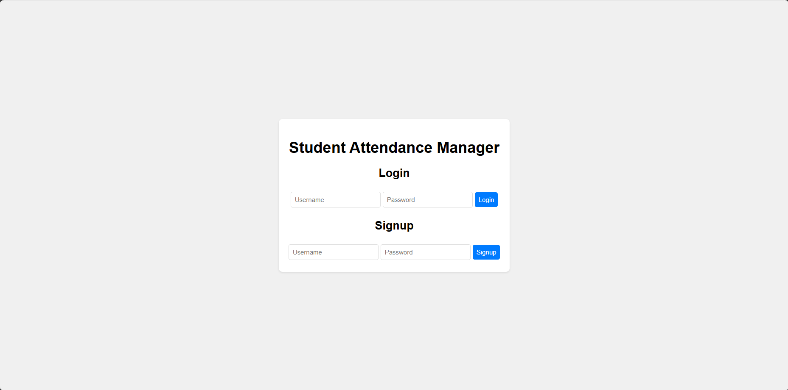
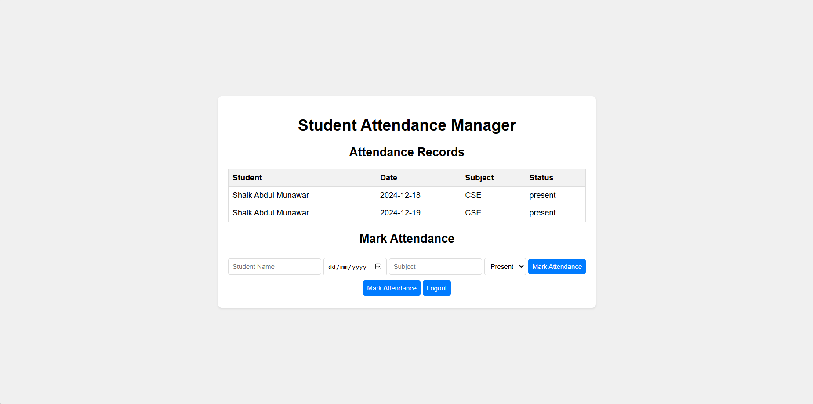

# Student Attendance Manager

This web application helps manage student attendance records. Users can sign up, log in, and mark attendance for students. The application stores user credentials and attendance records in the browser's local storage.

## Features

- User Signup and Login
- Dashboard to view attendance records
- Form to mark attendance
- Responsive design

## Screenshots

### Login Page

### Home Page

### Attendance Page

## Author

Shaik Abdul Munawar

[LinkedIn](https://www.linkedin.com/in/shaik-abdul-munawar-b35821284)